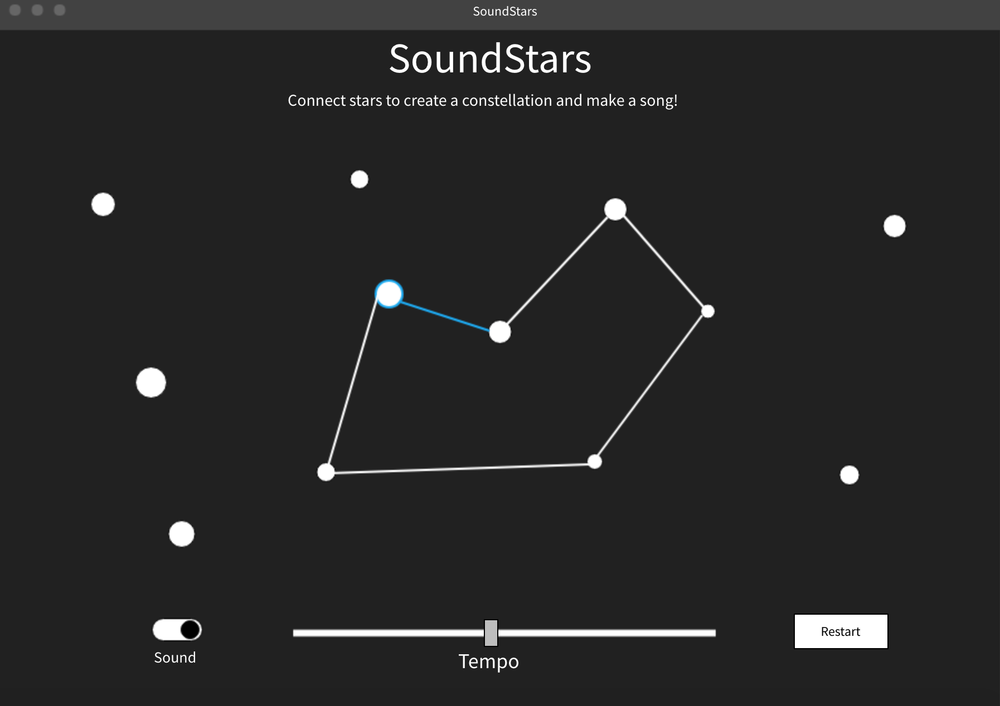

# SoundStars

## Background and Overview

SoundStars is an audio experience that combines an audio sequencer with the visualization of making constellations.

Users will be presented with a sky of randomly generated stars. When clicked, a star will make a sound. Users can then draw a line from one star to another.

When connected, stars will play their tones in the order they were selected. Users can connect as many stars as they want to make a star constellation that plays a sequential song.

Additionally, users can reset the sky to have new stars, mute the audio playback, and control the tempo.

## Functionality & MVP

* Sky is populated with random assortment of stars, which should twinkle
* Each star has an associated sound that plays when clicked
* Users can drag a line to another star to connect them
* Sounds will play sequentially based on how they're connected
* Users can control sound with mute and tempo, or reset the sky
* Have some simple instructions

## Wireframes

## Architecture and Technologies

SoundStars will use the following technologies: 
* `Vanilla Javascript` for structure and logic
* `HTML5 Canvas` for DOM manipulation and rendering
* `Web Audio API` for attaching sounds to stars and playing sequence
* `Webpack` for bundling all files

SoundStars will also have the following files: 

* `sky.js` : this will hold the logic for generating all of the stars, as well as keeping track of how stars are connected
* `stars.js` : this will hold the info for a particular star, including its associated sound
* `audio.js` : this will handle all of the audio logic, including playing all of the sounds in sequence

## Implementation Timeline

**Day 1:** 
* Come up with project idea and write proposal
* Review tutorials for Canvas and WebAudio
* Review past vanilla Javascript projects

**Day 2:**
* Create project skeleton with npm modules and webpack
* Get stars showing up on canvas
* Randomly generate placement of stars
* Add button to reload new stars

**Day 3:**
* Work with Web Audio to get sounds connected to the stars
* Figure out what sounds I want to use with the stars
* Add onClick listeners to stars to play the sound when clicked

**Day 4:**
* Get lines to draw from star to star
* Work on getting stars to play their tones in sequence after they're connected

**Day 5:**
* Add ability to change tempo and mute
* Add instructions
* Finish styling

**Weekend:**
* Finish styling and debugging
* Work on bonuses, if time

## Bonus

* Have animation when stars are connected. Currently playing star is highlighted and the line has an indication of where the current sequence is at
* Add option for different kinds of sounds
* Perhaps instead of clicking, users could drive a space ship from star to star to connect them