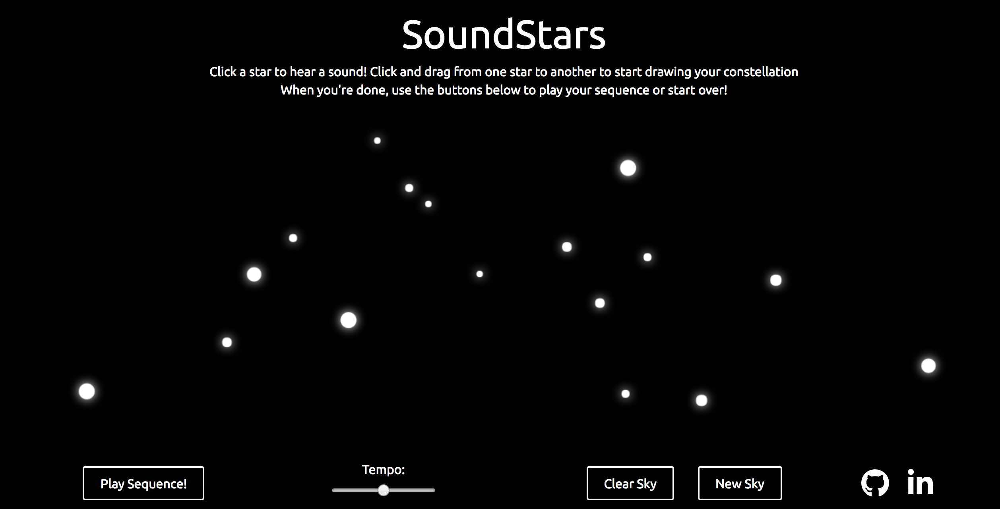
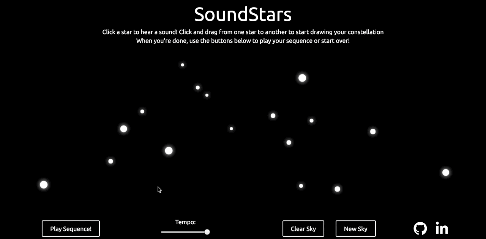
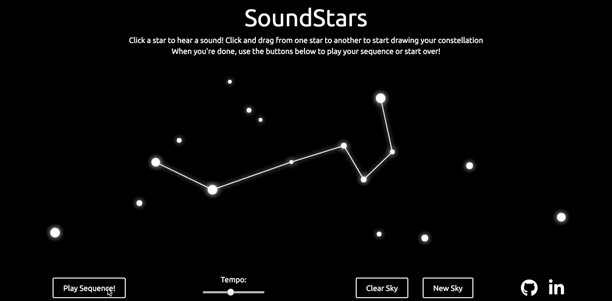

# StarSounds

[StarSounds live](https://sam-mcclure.github.io/SoundStars/)

StarSounds is an audio experience that combines an audio sequencer with the visualization of making constellations. 

A sky full of stars is randomly generated and users can click on a star to hear its sound or drag a line from one star to another to start drawing a constellation.

After drawing a constellation, a user can click the play button to hear the sounds play back in the order that the lines were drawn. Additionally, users can adjust the tempo of the playback, clear their sky, or generate a new one.

## Technologies

This project was built in one week with vanilla Javascript and HTML5 Canvas.

## Features

### A Sky full of Stars

When the page loads, 17 stars of different sizes are randomly placed around the sky. 



This was accomplished by calling an addStars method in the initialization of the sky that would make new stars at random positions: 

```js
addStars() {
    for (let i = 0; i < NUM_STARS; i++) {
      this.stars.push(
        new Star({
          pos: this.randomPosition(),
          idx: i
        })
      );
    }
  }
```

To make sure that stars didn't spawn on top of each other or off the edge of the screen, several checks were implemented into the randomPosition method:

```js
randomPosition() {
    let xCoord = DIM_X * Math.random();
    let yCoord = DIM_Y * Math.random();

    let noOverlap = false;

    while (noOverlap === false) {

      let changedCoords = this.checkOverlapStars(xCoord, yCoord);
      xCoord = changedCoords[0];
      yCoord = changedCoords[1];

      if (xCoord < 50 || xCoord >= DIM_X - 50) {
        xCoord = DIM_X * Math.random();
      } else if (yCoord < 50 || yCoord >= DIM_Y - 50) {
        yCoord = DIM_Y * Math.random();
      } else {
        noOverlap = true;
      }
    }
    

    return [xCoord, yCoord];
  }
```

### Drawing Constellations



In order to draw a constellation, a user must click and drag from one star to another. This was challenging because the canvas doesn't know where the stars are, so I had to check the mouse position and see if it was within any of the stars that I had generated at the start

```js
getCursorPosition(canv, event) {
    let rect = canv.getBoundingClientRect();
    let x = event.clientX - rect.left;
    let y = event.clientY - rect.top;
    return { x, y };
  }

  checkClickedStar(canv, event) {
    const cursorPos = this.getCursorPosition(canv, event);

    this.stars.forEach(star => {
      let xPos = star.pos[0];
      let yPos = star.pos[1];
      let r = star.radius;
      if (
        cursorPos.x <= xPos + r &&
        cursorPos.x >= xPos - r &&
        cursorPos.y <= yPos + r &&
        cursorPos.y >= yPos - r
      ) {
        if (this.firstStar === null) {
          this.firstStar = star;
          star.playSound();
        } else if (star !== this.firstStar) {
          this.secondStar = star;
          star.playSound();
        }
      }
    });
  }
```

After finding out if a star was clicked, I had to keep track of the mouse using 3 different events (mousedown, mousedrag, and mouseup). 

As the mouse moved, a line had to be redrawn at each new position. When the mouse was let go of, I had to check if the final destination was at another star, and if so, add those stars to the sequence and draw the final connecting line.

```js
lineStart(canv, event) {
    const cursorPos = this.getCursorPosition(canv, event);
    this.checkClickedStar(canv, event);
    let star = this.firstStar;
    if (star) {
      canvas.dragging = true;
      this.dragStart = [this.firstStar.pos[0], this.firstStar.pos[1]];
      this.takeSnapshot();
    }
  }

  lineDrag(canv, event) {
    if (canvas.dragging === true) {
      this.restoreSnapshot();
      const cursorPos = this.getCursorPosition(canv, event);
      const pos = [cursorPos.x, cursorPos.y];
      this.drawLine(pos);
    }
  }

  lineEnd(canv, event) {
    const cursorPos = this.getCursorPosition(canv, event);
    canvas.dragging = false;

    if (this.firstStar) {
      this.restoreSnapshot();
      this.checkClickedStar(canv, event);
      let nextStar = this.secondStar;

      if (nextStar) {
        this.drawLine([nextStar.pos[0], nextStar.pos[1]]);
        this.lines.push([this.firstStar, nextStar]);

        if (this.sequence[this.sequence.length - 1] !== this.firstStar) {
          this.sequence.push(this.firstStar);
        }
        this.sequence.push(this.secondStar);
      }
    }

    this.dragStart = null;
    this.firstStar = null;
    this.secondStar = null;
    this.snapshot = null;
  }
}
  ```

### Playing the sequence

When a user clicks the play sequence button, the sounds play back in the order that they were clicked in, with the currently playing star highlighted with a yellow glow. The tempo of playback can be adjusted with the slider.



Because playing back the sounds is an asynchronous action, but I needed them to play sequentially, I had to implement an async loop.

```js
playSequence() {
    let sequence = this.sequence;
    let draw = this.draw;
    let that = this;

    if (this.playing === false){
        this.playing = true;
        this.asyncLoop({
            length: sequence.length,
            functionToLoop: function (loop, i) {
                setTimeout(function () {
                    if (that.playing === false){
                      return;
                    }
                    let star = sequence[i];
                    star.drawSelected(context);
                    sequence[i].playSound();
                    loop();
                }, that.tempo);
            },
        });
    } 
  }
```

## Future Features

* Add more stars/colors
* Add more sound options
